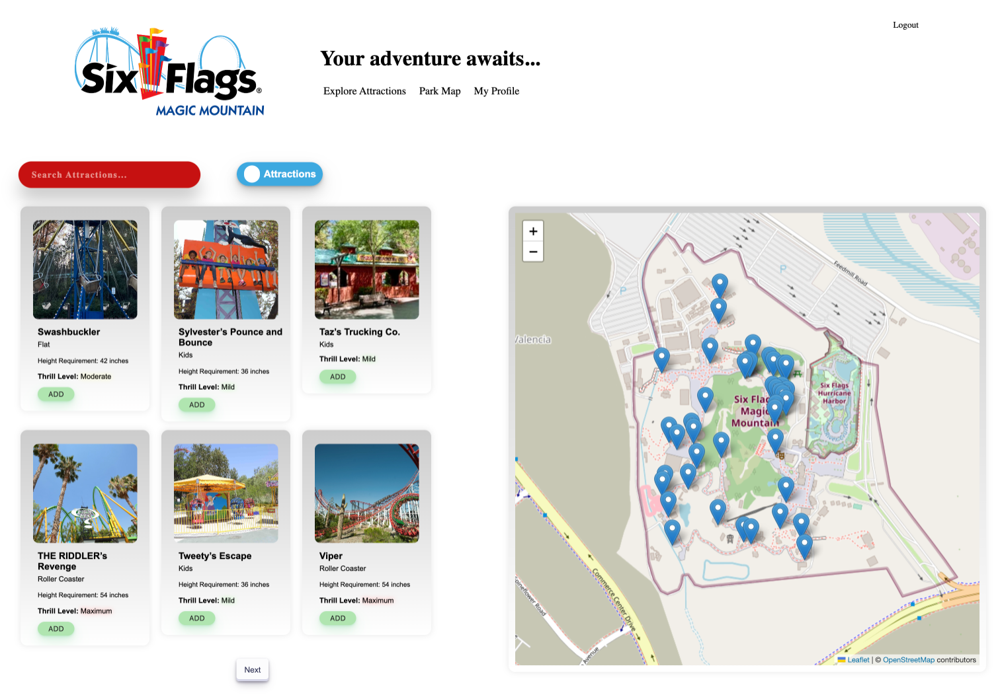
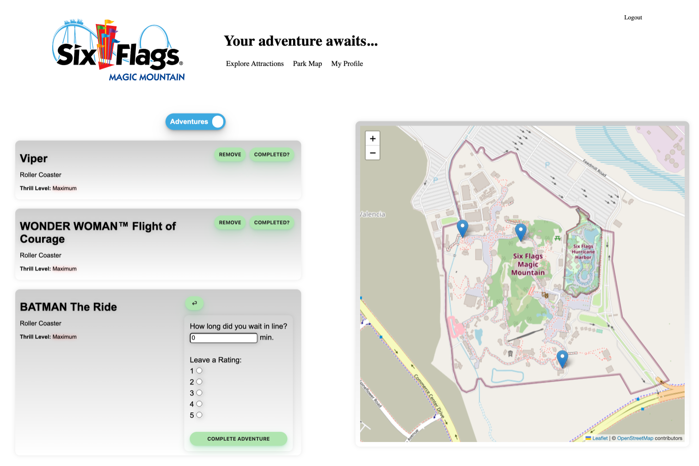
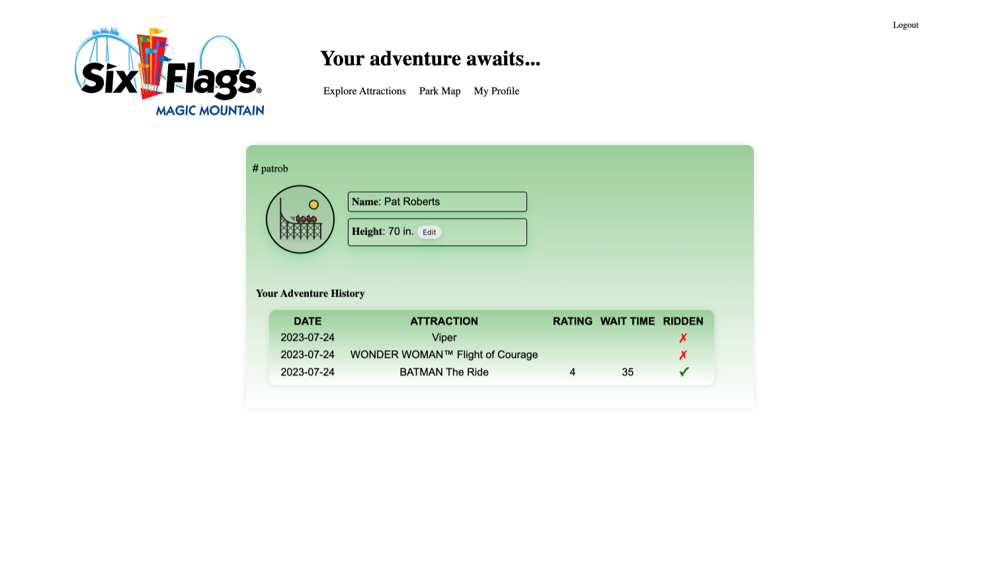
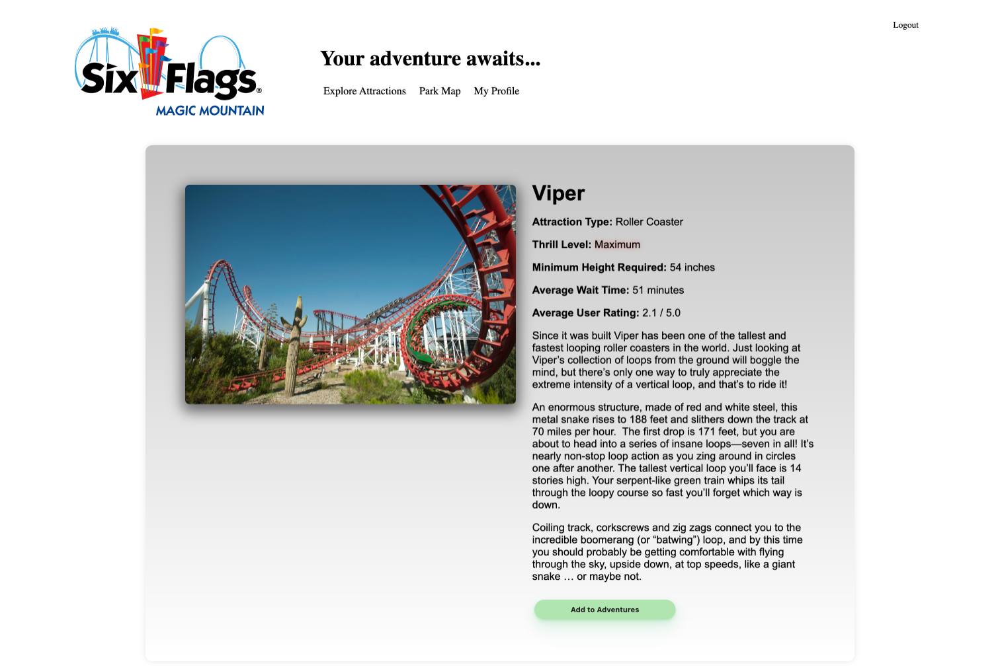

# Magic Mountain Adventures!

## About

Magic Mountain Adventures is an interactive theme-park planning app designed for Six Flags Magic Mountain in California.  The purpose is to allow the guest to make the most of their day at the park by discovering attractions near them, checking wait times, adding attractions to their itinerary and rating them once they've been experienced. 

## App Funcationality

Once logged in, the user will see a full map of the park along with icons for every attaction.  On the left, cards for containing information about the attractions can be viewed.  Users may also filter attractios by name, thrill level or type by using the search bar.  When the 'add' button is clicked, the ride is added to the user's 'Adventures' itinerary.

On the itinerary page, the map now shows only markers for attractions that have been selected.  The user can choose to either remove an attraction from their itinerary or, once the attraction is experienced, complete it.  When the attraction is completed the user can put down the wait they experienced and a rating for the attraction.  These details will then show up on the profile page.

Here the user can view the attractions they have added to their itierary as well as any attractions they've already experienced.  Each attraction also has it's own page which details relevant information about the ride including type, thrill level, height requirment, average wait time, average user rating and a description.  Average rating and wait time is cultivated from the backend after users complete attractions.

## App Development

Magic Mountain Adventures was developed at Flatiron School by a group of avid theme park lovers FOR avid theme park lovers.

-Frontend designed with React and styled with vanilla CSS.
-Backend written using Flask-SQLAlchemy and Python
-React-Leaflet used for Map integration and interactivity
-Attraction Database compiled using a mix of Webscraping and the Themeparks.wiki API
-Webscraping implemented using Beautiful Soup

## Future Features

-Live wait time integration using a theme park wait time API.
-Addtion of Entertainment offerings to the attraction lineup.
-Ability to offer suggested attractions based on live wait times and location data.
-More access to adventure and attraction data on users profile
-Expansion to other theme parks!